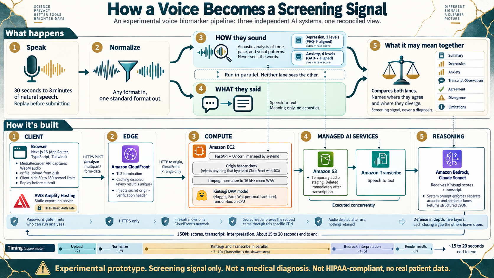

# Voice Biomarker POC

> **Experimental prototype. Screening signal only, never a medical diagnosis.**
> Not HIPAA-compliant. No real patient data was used. Nothing here should inform
> a clinical decision.

Two AI systems analyze the same recording without seeing each other's work, and a
third reconciles them into one view that says plainly where they agree and where
they disagree.



## The idea

An acoustic model can score depression and anxiety from **how** a voice sounds:
tone, pace, prosody. A speech-to-text system can tell you **what** the person
said. Either signal alone is weak. The interesting question is what happens when
you put them side by side.

So the two lanes are kept deliberately blind to each other. The acoustic model
never receives the transcript. The transcript path never receives the scores. A
language model then sees both and is instructed, in the system prompt, to keep
them in separate lanes and to name divergence explicitly rather than smooth it
over.

That constraint is the whole design. If the two lanes agreed because one had
been told what the other found, agreement would mean nothing. Because they are
blind, agreement is weak evidence and disagreement is interesting, and the
output is allowed to say so.

The reconciler is also told, in as many words, that it did not detect anything
itself. It is interpreting someone else's scores. A model handed a set of numbers
and asked to explain them will happily narrate its way into sounding like the
source of them, which in a mental-health context is exactly the wrong failure.

## What happens to a recording

| Stage | |
| --- | --- |
| **Capture** | browser `MediaRecorder` produces WebM, 30 seconds to 3 minutes enforced client-side, with replay before submit |
| **Normalize** | `ffmpeg` to mono 16 kHz WAV, because the acoustic model expects exactly that |
| **Acoustic lane** | Kintsugi DAM scores depression (3 classes, PHQ-9 aligned) and anxiety (4 classes, GAD-7 aligned). Runs on-box on CPU |
| **Semantic lane** | Amazon Transcribe. Requires its source in S3, so the WAV is staged there and deleted in a `finally` block once the job settles |
| **Reconcile** | Claude Sonnet on Amazon Bedrock, returning a fixed JSON shape: summary, depression, anxiety, transcript observations, agreement, divergence, limitations |

The two lanes run concurrently via `asyncio.gather`, since one is local CPU work
and the other is a remote job that spends most of its time waiting. End to end is
roughly 15 to 20 seconds, and Transcribe is the slow part at 7 to 10 of them.

Two details in `backend/app.py` worth knowing:

- The acoustic model is run **twice**, once unquantized for the raw scores and
  once quantized for the class labels, rather than deriving classes from the raw
  values. The model's own thresholds are better than any I would invent.
- The reconciler's output is un-fenced and parsed as JSON, and if parsing fails
  the raw text is returned as `summary` instead of throwing. A malformed
  interpretation is still worth showing; an exception is not.

## Defense in depth

Five layers, each closing a gap the others leave open. This was the most
instructive part to build.

1. **Basic Auth on the frontend.** Every analysis costs real Transcribe and
   Bedrock spend and nothing rate-limits repeat use, so the site itself is
   password-gated at the hosting layer. No code change.
2. **HTTPS via CloudFront.** The browser leg is TLS-terminated at the edge. No
   custom domain, no ACM certificate, no nginx or certbot on the box.
3. **Firewall.** The instance accepts port 8000 only from CloudFront's
   AWS-managed prefix list, plus one address for direct debugging.
4. **Origin secret.** The firewall proves a request came from *some* CloudFront
   distribution, not from *this* one. So the distribution injects a secret header
   and the app rejects anything arriving without it. `os.environ["ORIGIN_SECRET"]`
   is subscripted rather than `.get()` on purpose: an unset secret should crash
   the process at startup, because defaulting to `""` would make `"" == ""` pass
   and hand the door to anyone sending no header at all.
5. **No retention.** Audio exists in S3 only for the duration of one
   transcription job. The IAM role needs `s3:DeleteObject` for that cleanup to
   work, and without it the delete fails with `AccessDenied` while everything
   else keeps succeeding, so recordings accumulate silently. That one is worth
   remembering.

## Honest limitations

- **The model is not mine.** The acoustic scoring is
  [`KintsugiHealth/dam`](https://huggingface.co/KintsugiHealth/dam), Apache 2.0,
  a Whisper-small backbone. This repo integrates it; it does not improve on it.
- **A screening signal is not a finding.** Depression and anxiety classes aligned
  to PHQ-9 and GAD-7 bands are not PHQ-9 and GAD-7 results, and the UI says so.
- **CORS is wide open** (`allow_origins=["*"]`). The origin-secret header is the
  real gate, which makes the CORS policy redundant rather than dangerous, but it
  reads as sloppier than it is and should be narrowed.
- **The public IP is not elastic.** Stop and start the instance and the
  CloudFront origin breaks until the origin's `DomainName` is updated. Attaching
  an Elastic IP is the fix and was not done.
- **No tests.** This is a prototype that was built to be demonstrated, and
  pretending otherwise in a README would be worse than saying it.

## Layout

| | |
| --- | --- |
| `kintsugi-ui/` | Next.js App Router frontend, TypeScript and Tailwind, static export |
| `backend/` | a local mirror of the FastAPI service for editing. **Not auto-deployed**, changes are copied to the box and the service restarted |
| `CLAUDE.md` | orientation for AI assistants, plus every deployment gotcha hit along the way, written down as they happened |
| `prd.md` | what it was supposed to do before it did it |

## Running it

Backend setup, IAM requirements, and the systemd unit are in
[`backend/README.md`](backend/README.md). It needs Python 3.11, `ffmpeg`,
`git-lfs` for the model weights, and CPU-only PyTorch. An IAM role with S3
read, write, and **delete**, plus Transcribe and Bedrock invoke.

Frontend:

```bash
cd kintsugi-ui && npm install && npm run dev
```

`NEXT_PUBLIC_API_URL` points it at a backend, defaulting to
`http://localhost:8000`. In production it belongs in
`.env.production.local`, not `.env.production`, because `.env.local` outranks
`.env.production` in Next.js load order and a production build will otherwise
keep quietly using whatever the local file says.

Every AWS identifier in this repo is a placeholder: account id, instance id, IPs,
security groups, distribution id and domain, Amplify app id. The S3 bucket name
embeds an account id, so it comes from `VBP_BUCKET` with no default.
